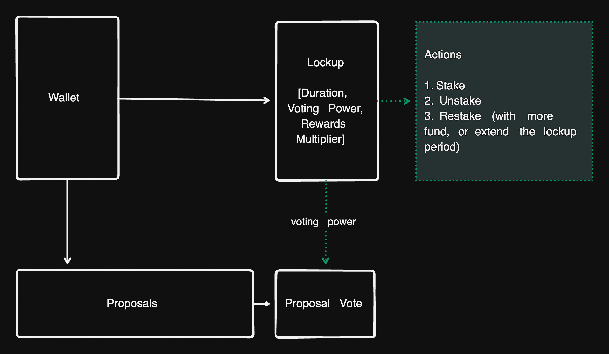

# VeToken

VeToken is an open source vote escrow based simplified solana staking program for veNFT.

| Network | Program Address |
| ----------- | ----------- |
| Devnet  | veTbq5fF2HWYpgmkwjGKTYLVpY6miWYYmakML7R7LRf |
| Mainnet | veTbq5fF2HWYpgmkwjGKTYLVpY6miWYYmakML7R7LRf |

# Architecture

# Features

- Simplified Lockup structure with full vote escrow and voting power decay support.
- Proposals and Proposal votes are based on the voting power of the lockup.
- Full permissionless composability.

# IDL
- [IDL - vetoken.json](./src/idl/vetoken.json)
- [Types - vetoken.ts](./src/types/vetoken.ts)

# License
Apache 2.0
