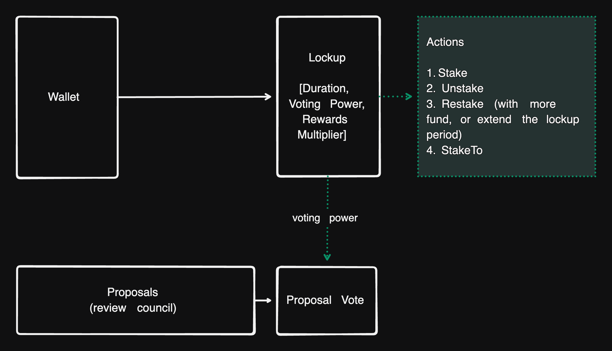

# VeToken

VeToken is an open source vote escrow based simplified solana staking program for any Tokenk or Token22.

| Network | Program Address |
| ----------- | ----------- |
| Devnet  | veTbq5fF2HWYpgmkwjGKTYLVpY6miWYYmakML7R7LRf |
| Mainnet | veTbq5fF2HWYpgmkwjGKTYLVpY6miWYYmakML7R7LRf |


# Architecture



The endpoints' detailed explanation can be found at [lib.rs](./programs/vetoken/src/lib.rs).

# Features

- Simplified Lockup structure with full vote escrow and voting power decay support.
- Proposals and Proposal votes are based on the voting power of the lockup.
- Stake and StakeTo with different rewards settings
- Security Council and Review Council governance model design
- Full permissionless composability.

# Development

```bash
# Test build and running the bankrun tests
npm i
anchor build && npm run test -- run

# Production build
anchor build

# Update IDL (if there's any IDL change)
anchor run update_idl
```

# IDL
- [IDL - vetoken.json](./src/idl/vetoken.json)
- [Types - vetoken.ts](./src/types/vetoken.ts)

# License
Apache 2.0
